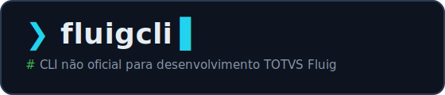

<div align="center">



**TOTVS Fluig direto do terminal: importe, implante e automatize
os artefatos da plataforma.**

[](https://github.com/alorenco/fluig-cli/releases/latest)
[](https://github.com/alorenco/fluig-cli/actions/workflows/ci.yml)
[](go.mod)
[](https://github.com/alorenco/fluig-cli/releases)
[](LICENSE)

</div>

> ⚠️ **Projeto não oficial, sem qualquer vínculo com a TOTVS.**
> "Fluig" e "TOTVS" são marcas de seus respectivos donos.

Feita para desenvolvedores, **agentes de IA** e pipelines de CI/CD, modo
não-interativo, saída JSON e exit codes estáveis. Hoje cobre datasets,
formulários, eventos globais, mecanismos de atribuição, scripts de processo e
widgets — e a lista de recursos continua crescendo.

## Instalação

**Linux e macOS:**

```sh
curl -fsSL https://raw.githubusercontent.com/alorenco/fluig-cli/main/install.sh | sh
```

**Windows (PowerShell):**

```powershell
irm https://raw.githubusercontent.com/alorenco/fluig-cli/main/install.ps1 | iex
```

O script detecta o sistema, baixa a última versão de
[Releases](https://github.com/alorenco/fluig-cli/releases), confere o checksum
e instala. Prefere fazer manualmente? Baixe o binário da sua plataforma direto
de Releases e coloque no `PATH` — ou compile do código-fonte (Go ≥ 1.26):

```sh
go install github.com/alorenco/fluig-cli/cmd/fluigcli@latest
```

Autocompletar (bash/zsh/fish/powershell):

```sh
source <(fluigcli completion bash)      # veja: fluigcli completion --help
```

## Atualização

A própria CLI se atualiza — baixa a última release, confere o checksum e
substitui o binário no lugar:

```sh
fluigcli upgrade
```

Quando sai versão nova, a CLI avisa sozinha ao fim de um comando (no máximo uma
vez por dia, só em terminal interativo; desative com
`FLUIGCLI_NO_UPDATE_CHECK=1`). Detalhes em [docs/upgrade.md](docs/upgrade.md).

## Quickstart

```sh
# 1. Cadastre os servidores (a senha vai para o keyring do SO — nunca para arquivo).
#    O primeiro cadastrado vira o padrão; servidores "prod" ganham trava de escrita.
fluigcli server add --name homolog --host fluig-hml.empresa.com.br --username admin.deploy --env hml
fluigcli server add --name producao --host fluig.empresa.com.br --username admin.deploy --env prod

# 2. Teste o acesso (login + ping + dados do usuário + status da widget auxiliar)
fluigcli server test homolog

# 3. Trabalhe com os artefatos — sem --server, vale o servidor padrão
fluigcli dataset list
fluigcli dataset import ds_clientes
fluigcli dataset export datasets/ds_clientes.js

# 4. Troque o padrão quando precisar (ou aponte pontualmente com --server)
fluigcli server use producao
fluigcli dataset export datasets/ds_clientes.js   # pede confirmação: producao é prod
```

## Comandos

| Grupo | Comandos | Doc |
|---|---|---|
| `server` | `add` `list` `use` `update` `remove` `test` `logout` `install-helper` | [docs/server.md](docs/server.md) |
| `dataset` | `list` `import` `export` `query` | [docs/dataset.md](docs/dataset.md) |
| `event` | `list` `import` `export` `delete` | [docs/event.md](docs/event.md) |
| `mechanism` | `list` `import` `export` `delete` | [docs/mechanism.md](docs/mechanism.md) |
| `form` | `list` `import` `export` | [docs/form.md](docs/form.md) |
| `workflow` | `version` `export` | [docs/workflow.md](docs/workflow.md) |
| `widget` | `list` `import` `export` | [docs/widget.md](docs/widget.md) |
| `skill` | `install` `show` | [docs/skill.md](docs/skill.md) |
| — | `version` `upgrade` `completion` | [docs/upgrade.md](docs/upgrade.md) |

Comandos e flags em **inglês**; mensagens, ajuda e logs em **pt-BR** (`fluigcli <cmd> --help`).

## Estrutura de projeto Fluig

A CLI opera sobre um diretório com a convenção de projetos Fluig:

```
projeto/
├── .fluigcli/servers.json         # servidores (sem senha; versionável)
├── datasets/<nome>.js
├── events/<nome>.js
├── forms/<NomeForm>/{<html>, *.js, events/<evento>.js}
├── mechanisms/<nome>.js
├── reports/
├── wcm/widget/<NomeWidget>/src/main/...
└── workflow/scripts/<Processo>.<evento>.js

```

## Uso por agentes de IA e CI/CD

- `--json`: stdout recebe **exatamente um** documento JSON com envelope fixo
  (`{ok, command, server, data, error}`); todo log vai para o stderr.
- `--json` implica modo não-interativo; fora de um TTY, o modo não-interativo é
  automático.
- Senha sem prompt: variável `FLUIGCLI_PASSWORD` ou `--password-stdin`.
- A sessão é reaproveitada entre execuções (cache em disco), então rodar vários
  comandos em sequência não faz login a cada vez. Desative com `--no-session-cache`.

Exit codes estáveis (documentados e cobertos por teste):

| Código | Significado |
|---|---|
| 0 | Sucesso total |
| 1 | Erro genérico/inesperado |
| 2 | Uso incorreto (argumento faltando, flag inválida) |
| 3 | Falha de autenticação/sessão |
| 4 | Recurso não encontrado |
| 5 | Erro retornado pelo servidor Fluig |
| 6 | Sucesso parcial em lote (detalhes em `data.results[]`) |
| 7 | Dependência ausente no servidor (widget auxiliar) |

Exemplo (fluxo dirigido por agente):

```sh
echo "$SENHA" | fluigcli dataset export datasets/ds_x.js --server homolog \
  --password-stdin --json
# → {"ok":true,"command":"dataset export","server":"homolog",
#    "data":{"results":[{"id":"ds_x","action":"updated","success":true}]},"error":null}
echo $?   # 0
```

Flags globais: `--server` (`FLUIGCLI_SERVER`), `--project` (`FLUIGCLI_PROJECT`),
`--json`, `--yes`/`-y`, `--non-interactive` (`FLUIGCLI_NON_INTERACTIVE=1`),
`--verbose`/`-v`, `--timeout` (`FLUIGCLI_TIMEOUT`), `--no-session-cache`
(`FLUIGCLI_NO_SESSION_CACHE=1`).

### Skill para agentes (Claude Code / Codex)

O repositório traz uma Skill pronta que ensina o agente a dirigir o fluigcli
(contrato `--json`, exit codes, mapa de comandos). O conteúdo canônico está em
[`skills/fluigcli/`](skills/fluigcli/) e é embutido no binário — instale-o no
seu projeto com:

```sh
fluigcli skill install --target all   # Claude Code (.claude/skills/) + Codex (AGENTS.md)
fluigcli skill install --target claude --global   # no diretório do usuário
```

Reinstalar é idempotente (atualiza no lugar; não duplica o bloco do `AGENTS.md`
nem sobrescreve arquivos que você editou, salvo com `--force`). Ver
[docs/skill.md](docs/skill.md).

## Credenciais

A senha **nunca** é gravada em arquivo nem aceita como argumento de linha de
comando. Ordem de resolução: `--password-stdin` → `FLUIGCLI_PASSWORD` → keyring
do SO → prompt interativo (com oferta de salvar no keyring). Detalhes em
[docs/server.md](docs/server.md).

## Desenvolvimento

```sh
go build ./...
go test ./...
go test -tags=integration ./internal/fluig/   # integração (requer FLUIGCLI_TEST_*)
```

Veja [CONTRIBUTING.md](CONTRIBUTING.md) e a documentação de cada comando em
[docs/](docs/).

## Inspirações e agradecimentos

- **[fluig-vscode-extension](https://github.com/fluiggers/fluig-vscode-extension)** —
  extensão VS Code para desenvolvimento Fluig, a principal inspiração desta CLI.
- **[fluig-widget-helper](https://github.com/fluiggers/fluig-widget-helper)** —
  widget auxiliar que a CLI instala no servidor (`fluigcli server install-helper`)
  e usa nas operações sem API nativa no Fluig.

## Licença

[MIT](LICENSE)
